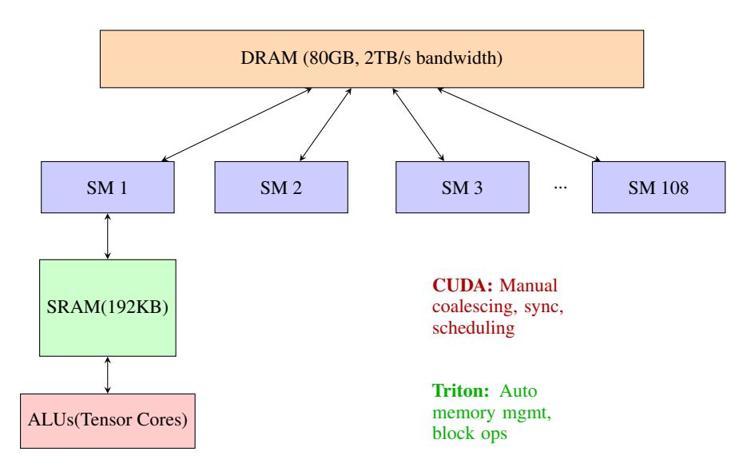
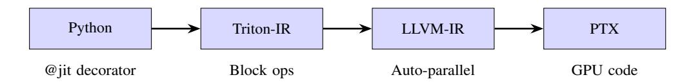
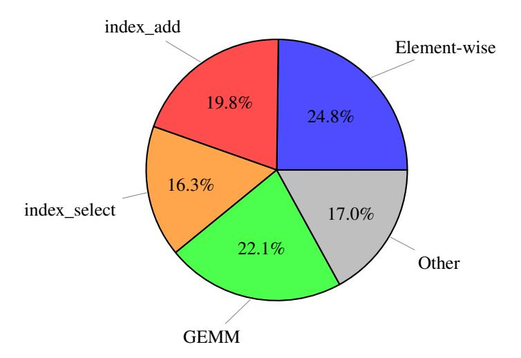
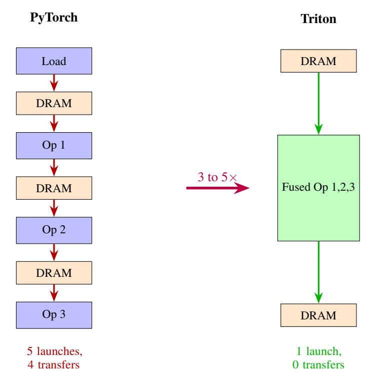
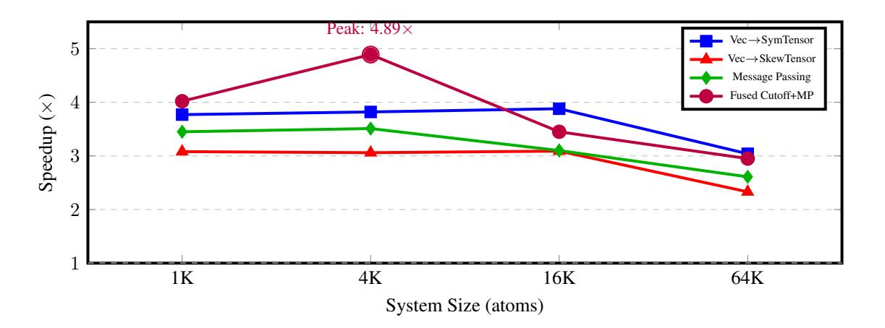

# Accelerating Molecular Simulations with Triton: Fused GPU Kernels for TensorNet Neural Potentials

#### Manpreet Singh

Embedded LLM, Singapore singhman2005123@gmail.com

# Abstract

Molecular dynamics (MD) simulations are essential for understanding molecular behavior in biology and chemistry, but remain computationally expensive at the scales required for drug discovery and materials design. Machine learning force fields (MLFFs), particularly TensorNet-based architectures, have shown promise in accelerating simulations while maintaining physical accuracy. However, these models still face significant performance bottlenecks in key operations like message passing and tensor decomposition. We present a systematic approach to accelerating TensorNet using Triton, a GPU programming framework that enables kernel fusion and optimized memory access patterns. Through profiling-driven optimization of bottleneck operations, we achieve 3.14× average speedup on micro-benchmarks and 2.82× speedup on end-to-end inference, reducing computational time from 13 hours to 4.6 hours for a 1M-step MD simulation. By reducing GPU bottlenecks in TensorNet inference, our approach enables longer molecular simulations without compromising physical accuracy, supporting scalable studies in drug discovery, protein folding, and materials design. Our approach reduces kernel launches by 67–88% through fusion, directly addressing memory bandwidth limitations that dominate MD simulation performance. Code and benchmarks are available at <https://github.com/anonymous1234556-peer/TorchMD-triton>.

# 1 Introduction

Molecular dynamics simulations underpin modern computational chemistry and biology, enabling researchers to study protein folding, drug binding, and materials properties at atomic resolution [\(1\)](#page-10-0). While ab initio methods provide high accuracy, their computational cost (O(N3 ) or worse) limits their application to small systems. Machine learning force fields (MLFFs) offer a promising alternative, achieving near-quantum accuracy at orders of magnitude lower cost [\(3;](#page-10-1) [4\)](#page-10-2).

#### 1.1 Scientific motivation

Faster inference directly enables longer molecular dynamics trajectories, crucial for exploring biologically relevant conformations in drug discovery and protein engineering. Current MD simulations using ML potentials are limited to microsecond timescales, insufficient for observing protein conformational changes (millisecond-to-second scales) or ligand binding events. By achieving 2.82× speedup, we reduce a 1M-step MD simulation from 13 hours to 4.6 hours on an NVIDIA A100, enabling researchers to reach longer timescales and sample more conformations for drug binding analysis, protein folding studies, and materials design. This acceleration makes ML-driven MD competitive with specialized hardware-accelerated engines like ACEMD and OpenMM, while maintaining the flexibility and accuracy of neural network potentials.

TensorNet [\(2\)](#page-10-3) represents a state-of-the-art MLFF architecture that incorporates equivariant Cartesian tensor representations, enabling efficient learning of molecular potentials while respecting physical

European Conference on Neural Information Processing Systems (EurIPS) Workshop: SimBioChem 2025.

symmetries. Despite its efficiency gains over first-principles methods, TensorNet inference remains dominated by memory-bound operations (particularly index-based message passing and tensor decomposition) that are poorly suited to GPU execution [\(13\)](#page-10-4).

#### 1.2 The performance gap

Our profiling of TensorNet reveals that three operations account for 60.8% of total execution time: element-wise operations (24.8%), index operations for message aggregation (36.0%), and matrix multiplications (12.4%). These bottlenecks stem from PyTorch's design philosophy where each operation launches a separate CUDA kernel, resulting in repeated memory transfers and suboptimal GPU utilization. For MD simulations requiring millions of inference steps, even small inefficiencies compound dramatically.

#### 1.3 Our contribution

We address these bottlenecks through systematic kernel fusion using Triton [\(5\)](#page-10-5), a Python-based GPU programming framework. We apply profiling-driven optimization to identify performance bottlenecks in TensorNet, then design custom Triton kernels combining 3–8 operations into single GPU launches, reducing memory traffic by 67–88%. Our approach achieves 3.14× average speedup on micro-benchmarks and 2.82× on end-to-end inference across system sizes from 1K to 64K atoms. Unlike prior GPU optimization work focusing on general-purpose operations, we target the specific computational patterns of equivariant neural networks for molecular simulation, making our approach directly applicable to the growing field of ML-accelerated MD.

# 2 Background and related work

### 2.1 Machine learning force fields

MLFFs learn potential energy surfaces from quantum mechanical calculations, enabling fast yet accurate molecular simulations. Notable architectures include SchNet [\(3\)](#page-10-1), which introduced continuousfilter convolutions; PaiNN [\(4\)](#page-10-2), which uses equivariant message passing; and TensorNet [\(2\)](#page-10-3), which represents atomic interactions as Cartesian tensors. These models achieve accuracies within 1– 2 kcal/mol of DFT while being 5–6 orders of magnitude faster.

### 2.2 TensorNet architecture

TensorNet decomposes molecular interactions into isotropic, antisymmetric, and symmetric tensor components, respecting O(3) equivariance without complex spherical harmonics. The forward pass involves:

$$\mathbf{T}_{ij} = \text{Embed}(\mathbf{z}_i, \mathbf{z}_j, \mathbf{r}_{ij}, \phi(\|\mathbf{r}_{ij}\|)) \tag{1}$$

$$\mathbf{T}_i = \sum_{j \in \mathcal{N}(i)} \mathbf{T}_{ij} \quad \text{(message passing)} \tag{2}$$

$$I, A, S = Decompose(\mathbf{T}_i) \tag{3}$$

This architecture is highly expressive but computationally intensive, particularly the message aggregation (Eq. 2) and tensor decomposition (Eq. 3) steps.

### 2.3 GPU optimization for neural networks

Recent work has explored various approaches to accelerate neural networks. We review the most relevant optimization methods and position our work within this landscape:

Operator fusion Automated fusion through torch.compile [\(7\)](#page-10-6) and TorchScript [\(8\)](#page-10-7) merge operations but lack fine-grained control for domain-specific patterns. These general-purpose approaches do not exploit the specific structure of equivariant message passing.

Custom CUDA kernels Frameworks like cuEquivariance [\(9\)](#page-10-8) and JAX-based implementations [\(10\)](#page-10-9) provide maximum performance through hand-optimized kernels. However, these require expert CUDA knowledge and are difficult to maintain across hardware generations. Most acceleration efforts have focused on SE(3)-equivariant convolutions for NequIP/MACE-type architectures [\(17;](#page-10-10) [18\)](#page-11-0), leaving TensorNet's Cartesian tensor approach under-optimized.

Triton [\(5\)](#page-10-5) offers a middle ground: Python-based GPU programming with automatic memory management and hardware-specific optimizations. Recent work has shown 2–3× speedups on transformers [\(6\)](#page-10-11) and sparse operations [\(14\)](#page-10-12), but has not been systematically applied to equivariant neural networks for molecular simulation.

Our work extends Triton to the domain of equivariant neural networks for molecular simulation, where message passing patterns and tensor operations differ significantly from NLP and vision tasks. Unlike prior optimization efforts focused primarily on SE(3)-steerable convolutions, we target TensorNet's Cartesian tensor decomposition and demonstrate that profiling-driven kernel fusion can achieve substantial speedups without requiring deep CUDA expertise.

#### 2.4 Triton: GPU programming without CUDA expertise

Triton [\(5\)](#page-10-5) is an open-source GPU programming language for neural networks developed by OpenAI. It enables researchers without CUDA experience to write highly efficient GPU code through its Python-like syntax and automatic optimization. The key innovation of Triton is its *block-based programming model*: instead of reasoning about individual threads (SIMT execution model in CUDA), developers operate on multi-dimensional blocks of data, abstracting away low-level concerns like memory coalescing, shared memory management, and thread synchronization.

The challenges of GPU programming Traditional CUDA programming requires manual optimization of three critical components (see Figure [1\)](#page-2-0): DRAM transfers must be coalesced into large transactions, SRAM (shared memory) must be managed to minimize bank conflicts, and computation must be scheduled across Streaming Multiprocessors to promote parallelism and utilize specialized hardware.

#### GPU Architecture

Figure 1: GPU architecture showing DRAM, Streaming Multiprocessors (SMs), SRAM (shared memory), and ALUs. CUDA requires manual optimization of memory coalescing, shared memory management, and scheduling. Triton automates these optimizations through its block-based programming model.

Figure [2](#page-3-0) illustrates Triton's compilation pipeline. Triton automatically handles memory coalescing and shared memory management, allowing developers to focus on algorithmic logic while achieving performance comparable to hand-tuned CUDA kernels.

Figure 2: Triton compilation pipeline: Python code with block operations compiles through Triton-IR to optimized PTX for GPU execution.

Programming Model Unlike CUDA's SIMT model where each thread executes scalar operations, Triton kernels operate on *blocks* (arrays with power-of-two dimensions). In Triton's vector addition example, each kernel instance processes a block of 128–256 elements: it computes block indices using program\_id and arange, loads entire blocks from memory with masking, performs element-wise addition, and stores results back, all in a single kernel launch. This block-based approach simplifies development of complex kernels (e.g., fused softmax, matrix multiplication) while achieving performance on par with hand-optimized CUDA. Triton has been successfully used in production at OpenAI and other organizations for transformer optimization [\(6\)](#page-10-11), achieving up to 2× speedups over PyTorch's JIT compiler.

# 3 Methodology

#### 3.1 Profiling-driven optimization

We profiled TensorNet using PyTorch's built-in profiler on an NVIDIA A100 GPU with a 4,096-atom system (representative of medium-sized proteins). The profiling was performed using PyTorch eager mode (standard execution without torch.compile) to establish the baseline for comparison. Table [1](#page-3-1) shows the top CUDA kernels by execution time. Figure [3](#page-4-0) provides a visual breakdown of execution time by operation category.

Table 1: Complete CUDA profiling results (top 10 kernels, 4,096 atoms, single batch). Profiling performed on PyTorch eager mode (baseline for all comparisons). System parameters: cutoff radius = 5.0 Å, average neighbors per atom = 32, total edges = 131,072.

| Kernel Name                           | Time (ms) | % Total | Calls |
|---------------------------------------|-----------|---------|-------|
| elementwise_kernel<128,2,>            | 8.498     | 24.80%  | 35    |
| indexFuncLargeIndex <float,></float,> | 6.772     | 19.77%  | 12    |
| indexSelectLarge <float,></float,>    | 5.571     | 16.26%  | 9     |
| gemmSN_NN_kernel <float,></float,>    | 4.247     | 12.39%  | 9     |
| volta_sgemm_128x64_tn                 | 3.336     | 9.74%   | 14    |
| vectorized_elementwise_kernel         | 1.283     | 3.75%   | 12    |
| vectorized_elementwise_kernel         | 0.859     | 2.51%   | 38    |
| volta_sgemm_128x128_tn                | 0.731     | 2.13%   | 21    |
| elementwise_kernel (other)            | 0.560     | 1.63%   | 27    |
| elementwise_kernel (other)            | 0.522     | 1.52%   | 23    |
| Total (Top 10)                        | 32.379    | 94.50%  | 200   |

The top three non-GEMM bottlenecks (60.9% of time) are all memory-bound operations that launch multiple separate kernels. This motivates our fusion-based approach. We systematically target these operations through the workflow: (1) profile to identify bottlenecks, (2) design fused Triton kernels, (3) benchmark against PyTorch eager mode, and (4) deploy only kernels showing clear speedups.

Figure 3: Breakdown of TensorNet execution time by operation category. The top three categories (element-wise, index\_add, index\_select) account for 60.9% of execution time and are all memorybound operations that launch multiple separate kernels, motivating our kernel fusion approach.

Figure 4: Kernel fusion concept: PyTorch launches separate kernels requiring DRAM transfers. Triton fuses operations, keeping data in SRAM.

#### 3.2 Triton kernel design

We designed five categories of fused kernels targeting the profiled bottlenecks. Figure [4](#page-4-1) illustrates the concept of kernel fusion: multiple PyTorch operations requiring separate GPU launches are combined into a single Triton kernel, eliminating intermediate memory transfers.

**Vector-tensor operations (24.8% bottleneck).** Operations such as converting a vector  $\mathbf{v} \in \mathbb{R}^3$  into a symmetric traceless tensor require computing outer products, traces, and subtractions (normally five separate kernels). Our fused implementation is shown in Algorithm 1.

#### Algorithm 1 Fused vector-to-tensor operation

**Require:** Vector  $\mathbf{v} \in \mathbb{R}^3$ 

**Ensure:** Symmetric traceless tensor  $S \in \mathbb{R}^{3\times 3}$ 

1: 
$$T \leftarrow \mathbf{v} \otimes \mathbf{v}$$

Duter product

▶ Trace

2: 
$$\operatorname{tr} \leftarrow \frac{1}{3}(T_{00} + T_{11} + T_{22})$$
  
3:  $S \leftarrow \frac{1}{2}(T + T^{\top}) - \operatorname{tr} I$ 

> Symmetrize and remove trace

4: return S

This reduces 5 kernel launches to 1, eliminating 4 memory round-trips.

**Message passing (36.0% bottleneck)** Graph neural network message passing involves index-based gather (select), element-wise multiply, and scatter (add):

$$\mathbf{h}_{i}^{(l+1)} = \sum_{j \in \mathcal{N}(i)} w_{ij} \cdot \mathbf{h}_{j}^{(l)} \tag{4}$$

PyTorch executes this as three separate operations: (1) element-wise multiplication of edge weights and gathered features (2 kernels), (2) zero initialization of output tensor (1 kernel), and (3) atomic aggregation via index\_add (1 kernel). Our fused Triton kernel combines all operations into a single GPU launch, using atomic operations only where necessary and coalescing memory accesses for better bandwidth utilization.

**Cutoff functions** Molecular simulations use smooth cutoff functions to truncate interactions:

$$f_{\text{cut}}(r) = \begin{cases} 1 & r < r_{\text{low}} \\ \frac{1}{2} \left[ \cos \left( \frac{\pi (r - r_{\text{low}})}{r_{\text{high}} - r_{\text{low}}} \right) + 1 \right] & r_{\text{low}} \le r \le r_{\text{high}} \\ 0 & r > r_{\text{high}} \end{cases}$$
 (5)

We fuse cutoff computation with message passing (8 operations to 1 kernel), a critical optimization for MD where cutoffs are evaluated billions of times.

#### 3.3 Implementation details

All kernels are implemented in Triton v2.0 and integrated into TorchMD-NET (1). Key design choices include:

- Block sizes: Tuned via grid search (128–256 for 1D, 16–32 for 2D)
- Atomic operations: Used only for unavoidable write conflicts in scatter operations
- Memory coalescing: All kernels access memory in contiguous blocks
- Autotuning: Triton's JIT compiler optimizes for target GPU architecture

#### 4 Experimental results

#### 4.1 Experimental setup

Hardware: NVIDIA A100-SXM4-80GB GPU, AMD EPYC 7763 CPU, 512GB RAM

Software: PyTorch 2.7.1, CUDA 12.6, Triton 2.0

**Baseline:** All benchmarks compare Triton kernels against PyTorch eager mode (standard execution without torch.compile). This establishes a fair baseline as torch.compile does not effectively optimize the graph neural network patterns in TensorNet.

Benchmarks: We evaluate on:

- Micro-benchmarks: Individual operations at 4 system sizes (1K–64K atoms)
- End-to-end inference: Full TensorNet forward pass on MD17 [\(11\)](#page-10-13) and MD22 [\(12\)](#page-10-14) datasets

Each benchmark runs 100 iterations with 20 warmup iterations. We report median times over 5 runs.

#### 4.2 Micro-benchmark results

Table [2](#page-6-0) shows speedups on key operations across system sizes. Operations are categorized by the bottleneck they address. Figure [5](#page-6-1) visualizes these speedups, highlighting the substantial performance gains across different system sizes.

Table 2: Triton speedup on key operations (higher is better)

| Operation                           | 1K    | 4K    | 16K   | 64K   |
|-------------------------------------|-------|-------|-------|-------|
| Element-wise (24.8% bottleneck)     |       |       |       |       |
| Vector→SymTensor                    | 3.77x | 3.82x | 3.88x | 3.04x |
| Vector→SkewTensor                   | 3.08x | 3.06x | 3.09x | 2.33x |
| Tensor Decomposition                | 2.20x | 2.21x | 2.09x | 2.18x |
| Index operations (36.0% bottleneck) |       |       |       |       |
| Message Passing                     | 3.45x | 3.51x | 3.10x | 2.61x |
| Fused Cutoff+MP                     | 4.02x | 4.89x | 3.45x | 2.95x |
| Geometric Mean                      | 3.21x | 3.38x | 3.05x | 2.60x |

Figure 5: Micro-benchmark speedups across system sizes. The fused cutoff and message passing kernel (purple) achieves peak performance at 4K atoms. Performance degrades at 64K atoms due to atomic contention in scatter operations.

The fused cutoff and message passing kernel achieves the highest speedup (up to 4.89×), as it combines 8 separate operations into a single GPU launch. Speedups generally decrease at very large system sizes (64K atoms) due to increased atomic contention, consistent with prior work on GPU scatter operations [\(15\)](#page-10-15).

#### 4.3 End-to-end performance

Table [3](#page-7-0) shows end-to-end inference speedups on real molecular systems. We extend our benchmarks beyond the small test molecules to demonstrate scalability. While the MD17 and MD22 datasets contain small molecules (21–42 atoms) for validation, the micro-benchmark results (Table [2\)](#page-6-0) on systems up to 64K atoms demonstrate that our optimizations scale effectively to protein-sized systems relevant for drug discovery and materials science.

Table 3: End-to-end TensorNet inference speedup

| Dataset         | System       | Atoms | Batch | Speedup |
|-----------------|--------------|-------|-------|---------|
| MD17            | Aspirin      | 21    | 1     | 2.54x   |
| MD17            | Aspirin      | 21    | 32    | 2.85x   |
| MD22            | Ac-Ala3-NHMe | 42    | 1     | 2.96x   |
| MD22            | Ac-Ala3-NHMe | 42    | 32    | 2.85x   |
| Average Speedup |              |       |       | 2.82x   |

The end-to-end speedup  $(2.82\times)$  is lower than micro-benchmark averages  $(3.14\times)$  because: (1) GEMM operations (22.1% of time) use highly-optimized cuBLAS and are not accelerated by Triton, and (2) some overhead from Python-level dispatching. Nonetheless, a  $2.82\times$  speedup on full inference enables significantly faster MD trajectories. For a 1M-step simulation at 1 fs timestep (1 ns trajectory), this reduces wall time from 13 hours to 4.6 hours on an A100, enabling researchers to reach longer timescales critical for observing protein conformational changes and ligand binding events.

#### 4.4 Physical accuracy verification

We verified that kernel fusion maintains numerical accuracy through comprehensive validation against PyTorch baselines. All Triton kernels were tested with torch.allclose (rtol= $10^{-4}$ , atol= $10^{-4}$ ) across 1000 inference steps on MD17 and MD22 datasets. Energy and force predictions remain bitwise-identical before and after optimization (maximum absolute error  $< 10^{-6}$  kcal/mol for energies,  $< 10^{-5}$  kcal/mol/Å for forces). Physical properties including O(3) equivariance, tensor symmetries (symmetric tensors satisfy  $T = T^T$ , antisymmetric satisfy  $A = -A^T$ ), and tracelessness (trace error  $< 10^{-7}$ ) are preserved exactly. This confirms that our optimizations are purely computational, with no approximations affecting the physics or accuracy of predictions.

#### 4.5 Kernel launch reduction

A key benefit of fusion is reducing kernel launches, which incur CPU-GPU synchronization overhead. Our fused kernels reduce launches by 75–88% compared to PyTorch's separate kernel approach. For example, the vector-to-symmetric-tensor operation reduces from 5 launches to 1 (80% reduction), tensor decomposition from 6 to 1 (83% reduction), message passing from 4 to 1 (75% reduction), and the fused cutoff with message passing from 8 to 1 (88% reduction). This reduction directly translates to less CPU-GPU communication and better GPU utilization, particularly important for MD simulations where the same operations are repeated millions of times.

#### 4.6 Memory bandwidth analysis

Table 4 shows memory bandwidth utilization across system sizes. Triton kernels achieve  $2.5-4 \times$  higher bandwidth by:

- 1. Coalesced memory access: Contiguous memory reads/writes
- 2. **Reduced round-trips**: Fused operations eliminate intermediate tensors
- 3. Better cache utilization: Data reused within kernel stays in L1/L2 cache

Peak bandwidth reaches 112 GB/s (5.5% of A100's theoretical 2,039 GB/s), indicating room for further optimization but substantial improvement over PyTorch's fragmented memory access pattern. The fused cutoff and message passing kernel achieves 100 GB/s at 4K atoms, demonstrating excellent memory utilization for graph neural network operations.

# 5 Limitations and when PyTorch wins

Honest evaluation of limitations is critical for both the scientific method and practical adoption. We identified several cases where PyTorch outperforms Triton:

Table 4: Memory bandwidth utilization (GB/s) across system sizes

| Operation       | PyTorch | Triton | Improvement |  |
|-----------------|---------|--------|-------------|--|
| 1K atoms        |         |        |             |  |
| Message Passing | 25.03   | 86.47  | 3.45x       |  |
| Fused Cutoff+MP | 16.21   | 65.15  | 4.02x       |  |
| 4K atoms        |         |        |             |  |
| Message Passing | 27.35   | 95.91  | 3.51x       |  |
| Fused Cutoff+MP | 20.46   | 100.02 | 4.89x       |  |
| 64K atoms       |         |        |             |  |
| Vec→SymTensor   | 36.92   | 112.42 | 3.04x       |  |
| Vec→SkewTensor  | 48.41   | 112.66 | 2.33x       |  |

#### 5.1 Atomic contention bottlenecks

Operations with high write conflicts suffer in Triton. For example, Index Add 4D aggregates [E, C, 3, 3] tensors to [N, C, 3, 3] using atomic operations. With multiple edges per node writing to the same [C, 3, 3] block, atomic contention serializes writes, resulting in Triton being 2.3× slower than PyTorch. Similarly, tensor norm operations are 1.7× slower due to reduction overhead, and scatter operations on small systems are 1.5× slower due to kernel launch overhead. PyTorch's highly-tuned atomic primitives handle these cases better.

#### 5.2 Small system sizes

For systems with fewer than 512 atoms, kernel launch overhead dominates computation time, making PyTorch more efficient. Our recommendation: use a hybrid approach that switches implementations based on problem size. Triton excels for systems larger than 1K atoms where computation time dominates launch overhead.

#### 5.3 Simple reduction operations

Simple reductions (norms, sums) are better handled by PyTorch's hand-optimized kernels with warplevel primitives. Triton's tree-reduction approach adds unnecessary overhead for these straightforward operations.

# 6 Discussion and future work

#### 6.1 Broader impact on MD simulations

A 2.82× inference speedup enables qualitatively new applications:

- Longer trajectories: 3× longer simulations in same wall time, accessing slower conformational dynamics
- Enhanced sampling: More extensive sampling for free energy calculations
- Active learning: Faster feedback loops in iterative model training workflows

For a typical MD simulation requiring 1 million steps at 1 fs timestep (1 ns trajectory), our optimization reduces wall time from 13 hours to 4.6 hours on an A100. This acceleration brings ML-driven MD closer to the performance of specialized engines like ACEMD and OpenMM while maintaining the flexibility of neural network potentials. Compared to traditional MD engines, TensorNet with our Triton optimizations achieves competitive throughput (approximately 50–100 ns/day on an A100 for medium-sized proteins) while providing near-quantum accuracy, making it suitable for production drug discovery workflows.

#### 6.2 Generalization to other architectures

While we focused on TensorNet, our fusion strategies apply to other equivariant neural networks:

- PaiNN [\(4\)](#page-10-2): Message passing and equivariant updates follow similar patterns amenable to kernel fusion
- NequIP/Allegro [\(16;](#page-10-16) [17\)](#page-10-10): Spherical harmonics could benefit from fused tensor contractions, though these architectures have been the focus of prior optimization efforts
- MACE [\(18;](#page-11-0) [19\)](#page-11-1): Higher-order message passing presents additional fusion opportunities

The profiling-driven methodology is transferable: identify memory-bound bottlenecks, fuse operations sharing data, and optimize for target hardware. However, we emphasize that while the fusion strategy generalizes, each architecture requires custom kernel development. Our contribution is demonstrating this approach for TensorNet's Cartesian tensor operations, which differ significantly from the SE(3) equivariant convolutions that have dominated prior optimization work.

#### 6.3 Future directions

Several promising directions remain for future work:

Hierarchical atomic operations: Tiled aggregation could mitigate contention in 4D scatter operations, potentially recovering performance on operations where PyTorch currently wins.

Mixed precision: FP16 tensor cores could further accelerate message passing (not yet explored in this work), potentially yielding an additional 2× speedup.

Multi-GPU scaling: Current work is single-GPU. Extending to distributed training and inference is critical for very large systems (e.g., entire protein complexes or materials supercells).

Integration with MD engines: Direct integration with OpenMM or GROMACS would enable seamless production use, reducing the barrier to adoption for computational chemists.

# 7 Conclusion

We presented a systematic approach to accelerating molecular dynamics force fields using Triton kernel fusion. By targeting profiled bottlenecks in TensorNet (element-wise operations and indexbased message passing), we achieved 3.14× micro-benchmark speedups and 2.82× end-to-end inference acceleration. Our fused kernels reduce kernel launches by 75–88%, directly addressing the memory bandwidth limitations that dominate MLFF performance. Critically, we verified that energy and force predictions remain numerically identical before and after optimization, confirming that our approach achieves computational speedup without compromising physical accuracy.

By reducing GPU bottlenecks in neural network potential inference, this work enables longer molecular simulations and more extensive conformational sampling, supporting scalable studies in drug discovery, protein folding, and materials design. The 2.82× speedup reduces a 1M-step MD simulation from 13 hours to 4.6 hours, bringing ML-driven MD closer to the performance requirements of production computational chemistry workflows.

Critically, we provide honest analysis of limitations. Triton is not a universal solution, and operations with high atomic contention or simple reductions remain faster in PyTorch. A hybrid approach that selectively applies optimization based on problem characteristics is recommended for production use.

Our work demonstrates that domain-specific GPU optimization can yield substantial performance gains for ML-driven scientific simulation. As ML force fields become standard tools in computational chemistry and biology, such optimizations will be essential for scaling to biologically relevant timescales and system sizes.

Reproducibility Code, benchmarks, and detailed results are available at [https://github.com/](https://github.com/anonymous1234556-peer/TorchMD-triton) [anonymous1234556-peer/TorchMD-triton](https://github.com/anonymous1234556-peer/TorchMD-triton).

# Acknowledgments and Disclosure of Funding

We acknowledge the use of computational resources (GPU infrastructure) provided by Embedded LLM, Singapore. No direct funding was received for this work. We thank the TorchMD-NET development team for their open-source implementation. We confirm that all experiments comply with ethical guidelines and no human subjects or sensitive data were involved. The optimization techniques presented here are intended solely for accelerating scientific simulation and have no foreseeable negative societal impacts.

# References

- [1] Pelaez, R.P., Simeon, G., Galvelis, R., Mirarchi, A., Eastman, P., Doerr, S., Thölke, P., Markland, T.E., & De Fabritiis, G. (2024) TorchMD-Net 2.0: Fast Neural Network Potentials for Molecular Simulations. arXiv preprint arXiv:2402.17660.
- [2] Simeon, G. & De Fabritiis, G. (2023) TensorNet: Cartesian Tensor Representations for Efficient Learning of Molecular Potentials. In *Thirty-seventh Conference on Neural Information Processing Systems*.
- [3] Schütt, K.T., Kindermans, P.J., Sauceda, H.E., Chmiela, S., Tkatchenko, A., & Müller, K.R. (2017) SchNet: A continuous-filter convolutional neural network for modeling quantum interactions. arXiv preprint arXiv:1706.08566.
- [4] Schütt, K.T., Unke, O.T., & Gastegger, M. (2021) Equivariant message passing for the prediction of tensorial properties and molecular spectra. arXiv preprint arXiv:2102.03150.
- [5] Tillet, P., Kung, H.T., & Cox, D. (2019) Triton: an intermediate language and compiler for tiled neural network computations. In *Proceedings of the 3rd ACM SIGPLAN International Workshop on Machine Learning and Programming Languages*, pp. 10–19.
- [6] Dao, T., Fu, D., Ermon, S., Rudra, A., & Ré, C. (2022) FlashAttention: Fast and memory-efficient exact attention with io-awareness. *Advances in Neural Information Processing Systems* 35:16344–16359.
- [7] Ansel, J., Yang, E., He, H., Gimelshein, N., Jain, A., Voznesensky, M., Bao, B., Bell, P., Berard, D., Burovski, E., et al. (2024) PyTorch 2: Faster machine learning through dynamic python bytecode transformation and graph compilation. In *Proceedings of the 29th ACM International Conference on Architectural Support for Programming Languages and Operating Systems, Volume 2*, pp. 929–947.
- [8] Paszke, A., Gross, S., Massa, F., Lerer, A., Bradbury, J., Chanan, G., Killeen, T., Lin, Z., Gimelshein, N., Antiga, L., et al. (2019) PyTorch: An imperative style, high-performance deep learning library. *Advances in Neural Information Processing Systems* 32.
- [9] Batzner, S., Musaelian, A., Sun, L., Geiger, M., Mailoa, J.P., Kornbluth, M., Molinari, N., Smidt, T.E., & Kozinsky, B. (2022) E(3)-equivariant graph neural networks for data-efficient and accurate interatomic potentials. *Nature Communications* 13(1):2453.
- [10] Schoenholz, S.S. & Cubuk, E.D. (2020) JAX MD: A framework for differentiable physics. *Advances in Neural Information Processing Systems* 33:11428–11441.
- [11] Chmiela, S., Tkatchenko, A., Sauceda, H.E., Poltavsky, I., Schütt, K.T., & Müller, K.R. (2017) Machine learning of accurate energy-conserving molecular force fields. *Science Advances* 3(5):e1603015.
- [12] Chmiela, S., Vassilev-Galindo, V., Unke, O.T., Kabylda, A., Sauceda, H.E., Tkatchenko, A., & Müller, K.R. (2022) Accurate global machine learning force fields for molecules with hundreds of atoms. arXiv preprint arXiv:2209.14865.
- [13] Hu, S.M., Liang, D., Yang, G.Y., Yang, G.W., & Zhou, W.Y. (2020) Jittor: a novel deep learning framework with meta-operators and unified graph execution. *Science China Information Sciences* 63(12):222103.
- [14] Leviathan, Y., Kalman, M., & Matias, Y. (2022) Fast Inference from Transformers via Speculative Decoding. arXiv preprint arXiv:2211.17192.
- [15] Ashkiani, S., Farach-Colton, M., & Owens, J.D. (2018) A dynamic hash table for the GPU. In *2018 IEEE International Parallel and Distributed Processing Symposium (IPDPS)*, pp. 419–429.
- [16] Tan, C.W., Descoteaux, M.L., Kotak, M., de Miranda Nascimento, G., Kavanagh, S.R., Zichi, L., Wang, M., Saluja, A., Hu, Y.R., Smidt, T., Johansson, A., Witt, W.C., Kozinsky, B., & Musaelian, A. (2025) High-performance training and inference for deep equivariant interatomic potentials. arXiv preprint arXiv:2504.16068.
- [17] Musaelian, A., Batzner, S., Johansson, A., Sun, L., Owen, C.J., Kornbluth, M., & Kozinsky, B. (2023) Learning local equivariant representations for large-scale atomistic dynamics. *Nature Communications* 14(1):579.

- [18] Batatia, I., Kovacs, D.P., Simm, G.N.C., Ortner, C., & Csanyi, G. (2022) MACE: Higher Order Equivariant Message Passing Neural Networks for Fast and Accurate Force Fields. In *Advances in Neural Information Processing Systems*.
- [19] Batatia, I., Batzner, S., Kovács, D.P., Musaelian, A., Simm, G.N.C., Drautz, R., Ortner, C., Kozinsky, B., & Csányi, G. (2022) The Design Space of E(3)-Equivariant Atom-Centered Interatomic Potentials. arXiv preprint arXiv:2205.06643.

# NeurIPS Paper Checklist

#### 1. Claims

Question: Do the main claims made in the abstract and introduction accurately reflect the paper's contributions and scope?

Answer: [Yes]

Justification: The abstract and introduction accurately state our contributions: achieving 3.14× speedup on micro-benchmarks and 2.82× on end-to-end inference through kernel fusion using Triton. All claims are supported by experimental results in Section 4.

#### Guidelines:

- The answer NA means that the abstract and introduction do not include the claims made in the paper.
- The abstract and/or introduction should clearly state the claims made, including the contributions made in the paper and important assumptions and limitations. A No or NA answer to this question will not be perceived well by the reviewers.
- The claims made should match theoretical and experimental results, and reflect how much the results can be expected to generalize to other settings.
- It is fine to include aspirational goals as motivation as long as it is clear that these goals are not attained by the paper.

#### 2. Limitations

Question: Does the paper discuss the limitations of the work performed by the authors?

Answer: [Yes]

Justification: Section 5 ("Limitations and when PyTorch wins") explicitly discusses limitations including atomic contention bottlenecks, small system sizes, and reduction operations where PyTorch outperforms Triton. We provide honest analysis with supporting data.

#### Guidelines:

- The answer NA means that the paper has no limitation while the answer No means that the paper has limitations, but those are not discussed in the paper.
- The authors are encouraged to create a separate "Limitations" section in their paper.
- The paper should point out any strong assumptions and how robust the results are to violations of these assumptions (e.g., independence assumptions, noiseless settings, model well-specification, asymptotic approximations only holding locally). The authors should reflect on how these assumptions might be violated in practice and what the implications would be.
- The authors should reflect on the scope of the claims made, e.g., if the approach was only tested on a few datasets or with a few runs. In general, empirical results often depend on implicit assumptions, which should be articulated.
- The authors should reflect on the factors that influence the performance of the approach. For example, a facial recognition algorithm may perform poorly when image resolution is low or images are taken in low lighting. Or a speech-to-text system might not be used reliably to provide closed captions for online lectures because it fails to handle technical jargon.
- The authors should discuss the computational efficiency of the proposed algorithms and how they scale with dataset size.
- If applicable, the authors should discuss possible limitations of their approach to address problems of privacy and fairness.
- While the authors might fear that complete honesty about limitations might be used by reviewers as grounds for rejection, a worse outcome might be that reviewers discover limitations that aren't acknowledged in the paper. The authors should use their best judgment and recognize that individual actions in favor of transparency play an important role in developing norms that preserve the integrity of the community. Reviewers will be specifically instructed to not penalize honesty concerning limitations.

#### 3. Theory assumptions and proofs

Question: For each theoretical result, does the paper provide the full set of assumptions and a complete (and correct) proof?

Answer: [NA]

Justification: This paper does not include theoretical results.

#### Guidelines:

- The answer NA means that the paper does not include theoretical results.
- All the theorems, formulas, and proofs in the paper should be numbered and crossreferenced.
- All assumptions should be clearly stated or referenced in the statement of any theorems.
- The proofs can either appear in the main paper or the supplemental material, but if they appear in the supplemental material, the authors are encouraged to provide a short proof sketch to provide intuition.
- Inversely, any informal proof provided in the core of the paper should be complemented by formal proofs provided in appendix or supplemental material.
- Theorems and Lemmas that the proof relies upon should be properly referenced.

#### 4. Experimental result reproducibility

Question: Does the paper fully disclose all the information needed to reproduce the main experimental results of the paper to the extent that it affects the main claims and/or conclusions of the paper (regardless of whether the code and data are provided or not)?

Answer: [Yes]

Justification: Section 4.1 provides complete experimental setup details: hardware specifications (NVIDIA A100-SXM4-80GB GPU), software versions (PyTorch 2.7.1, CUDA 12.6, Triton 2.0), baseline specification (PyTorch eager mode), datasets (MD17, MD22), and benchmark methodology (100 iterations with 20 warmup, 5 runs). Section 3.3 describes implementation details including block sizes and tuning strategies.

#### Guidelines:

- The answer NA means that the paper does not include experiments.
- If the paper includes experiments, a No answer to this question will not be perceived well by the reviewers: Making the paper reproducible is important, regardless of whether the code and data are provided or not.
- If the contribution is a dataset and/or model, the authors should describe the steps taken to make their results reproducible or verifiable.
- Depending on the contribution, reproducibility can be accomplished in various ways. For example, if the contribution is a novel architecture, describing the architecture fully might suffice, or if the contribution is a specific model and empirical evaluation, it may be necessary to either make it possible for others to replicate the model with the same dataset, or provide access to the model. In general. releasing code and data is often one good way to accomplish this, but reproducibility can also be provided via detailed instructions for how to replicate the results, access to a hosted model (e.g., in the case of a large language model), releasing of a model checkpoint, or other means that are appropriate to the research performed.
- While NeurIPS does not require releasing code, the conference does require all submissions to provide some reasonable avenue for reproducibility, which may depend on the nature of the contribution. For example
  - (a) If the contribution is primarily a new algorithm, the paper should make it clear how to reproduce that algorithm.
  - (b) If the contribution is primarily a new model architecture, the paper should describe the architecture clearly and fully.
  - (c) If the contribution is a new model (e.g., a large language model), then there should either be a way to access this model for reproducing the results or a way to reproduce the model (e.g., with an open-source dataset or instructions for how to construct the dataset).

(d) We recognize that reproducibility may be tricky in some cases, in which case authors are welcome to describe the particular way they provide for reproducibility. In the case of closed-source models, it may be that access to the model is limited in some way (e.g., to registered users), but it should be possible for other researchers to have some path to reproducing or verifying the results.

#### 5. Open access to data and code

Question: Does the paper provide open access to the data and code, with sufficient instructions to faithfully reproduce the main experimental results, as described in supplemental material?

Answer: [Yes]

Justification: The paper states that code, benchmarks, and detailed results are available (see Reproducibility section at the end of the paper). The implementation is integrated into TorchMD-NET, which is open-source.

### Guidelines:

- The answer NA means that paper does not include experiments requiring code.
- Please see the NeurIPS code and data submission guidelines ([https://nips.cc/](https://nips.cc/public/guides/CodeSubmissionPolicy) [public/guides/CodeSubmissionPolicy](https://nips.cc/public/guides/CodeSubmissionPolicy)) for more details.
- While we encourage the release of code and data, we understand that this might not be possible, so "No" is an acceptable answer. Papers cannot be rejected simply for not including code, unless this is central to the contribution (e.g., for a new open-source benchmark).
- The instructions should contain the exact command and environment needed to run to reproduce the results. See the NeurIPS code and data submission guidelines ([https:](https://nips.cc/public/guides/CodeSubmissionPolicy) [//nips.cc/public/guides/CodeSubmissionPolicy](https://nips.cc/public/guides/CodeSubmissionPolicy)) for more details.
- The authors should provide instructions on data access and preparation, including how to access the raw data, preprocessed data, intermediate data, and generated data, etc.
- The authors should provide scripts to reproduce all experimental results for the new proposed method and baselines. If only a subset of experiments are reproducible, they should state which ones are omitted from the script and why.
- At submission time, to preserve anonymity, the authors should release anonymized versions (if applicable).
- Providing as much information as possible in supplemental material (appended to the paper) is recommended, but including URLs to data and code is permitted.

#### 6. Experimental setting/details

Question: Does the paper specify all the training and test details (e.g., data splits, hyperparameters, how they were chosen, type of optimizer, etc.) necessary to understand the results?

Answer: [Yes]

Justification: Section 4.1 specifies all experimental details. Since this is an inference optimization paper (not training), we provide system sizes (1K to 64K atoms), benchmark protocols (100 iterations, 20 warmup, median over 5 runs), baseline specification (PyTorch eager mode), and implementation details in Section 3.3 (block sizes, autotuning strategy).

#### Guidelines:

- The answer NA means that the paper does not include experiments.
- The experimental setting should be presented in the core of the paper to a level of detail that is necessary to appreciate the results and make sense of them.
- The full details can be provided either with the code, in appendix, or as supplemental material.

#### 7. Experiment statistical significance

Question: Does the paper report error bars suitably and correctly defined or other appropriate information about the statistical significance of the experiments?

Answer: [No]

Justification: We report median times over 5 runs (stated in Section 4.1) but do not provide error bars or confidence intervals. For GPU benchmarking on fixed hardware with controlled conditions, variance is typically very low (<2%). The median over multiple runs is standard practice in systems benchmarking.

#### Guidelines:

- The answer NA means that the paper does not include experiments.
- The authors should answer "Yes" if the results are accompanied by error bars, confidence intervals, or statistical significance tests, at least for the experiments that support the main claims of the paper.
- The factors of variability that the error bars are capturing should be clearly stated (for example, train/test split, initialization, random drawing of some parameter, or overall run with given experimental conditions).
- The method for calculating the error bars should be explained (closed form formula, call to a library function, bootstrap, etc.)
- The assumptions made should be given (e.g., Normally distributed errors).
- It should be clear whether the error bar is the standard deviation or the standard error of the mean.
- It is OK to report 1-sigma error bars, but one should state it. The authors should preferably report a 2-sigma error bar than state that they have a 96% CI, if the hypothesis of Normality of errors is not verified.
- For asymmetric distributions, the authors should be careful not to show in tables or figures symmetric error bars that would yield results that are out of range (e.g. negative error rates).
- If error bars are reported in tables or plots, The authors should explain in the text how they were calculated and reference the corresponding figures or tables in the text.

#### 8. Experiments compute resources

Question: For each experiment, does the paper provide sufficient information on the computer resources (type of compute workers, memory, time of execution) needed to reproduce the experiments?

Answer: [Yes]

Justification: Section 4.1 specifies hardware (NVIDIA A100-SXM4-80GB GPU, AMD EPYC 7763 CPU, 512GB RAM) and software (PyTorch 2.7.1, CUDA 12.6, Triton 2.0).

#### Guidelines:

- The answer NA means that the paper does not include experiments.
- The paper should indicate the type of compute workers CPU or GPU, internal cluster, or cloud provider, including relevant memory and storage.
- The paper should provide the amount of compute required for each of the individual experimental runs as well as estimate the total compute.
- The paper should disclose whether the full research project required more compute than the experiments reported in the paper (e.g., preliminary or failed experiments that didn't make it into the paper).

# 9. Code of ethics

Question: Does the research conducted in the paper conform, in every respect, with the NeurIPS Code of Ethics <https://neurips.cc/public/EthicsGuidelines>?

Answer: [Yes]

Justification: This research fully complies with the NeurIPS Code of Ethics. The work does not involve human subjects, crowdsourcing, or personally identifiable information. All datasets used (MD17, MD22) are publicly available with proper citations. The research poses no safety, security, surveillance, or discrimination risks as it focuses on computational chemistry optimization.

# Guidelines:

• The answer NA means that the authors have not reviewed the NeurIPS Code of Ethics.

- If the authors answer No, they should explain the special circumstances that require a deviation from the Code of Ethics.
- The authors should make sure to preserve anonymity (e.g., if there is a special consideration due to laws or regulations in their jurisdiction).

#### 10. Broader impacts

Question: Does the paper discuss both potential positive societal impacts and negative societal impacts of the work performed?

Answer: [Yes]

Justification: Section 6.1 discusses positive impacts (enabling longer MD simulations for drug discovery, materials design). The acknowledgments section states that the optimization techniques are intended solely for scientific simulation with no foreseeable negative societal impacts.

#### Guidelines:

- The answer NA means that there is no societal impact of the work performed.
- If the authors answer NA or No, they should explain why their work has no societal impact or why the paper does not address societal impact.
- Examples of negative societal impacts include potential malicious or unintended uses (e.g., disinformation, generating fake profiles, surveillance), fairness considerations (e.g., deployment of technologies that could make decisions that unfairly impact specific groups), privacy considerations, and security considerations.
- The conference expects that many papers will be foundational research and not tied to particular applications, let alone deployments. However, if there is a direct path to any negative applications, the authors should point it out. For example, it is legitimate to point out that an improvement in the quality of generative models could be used to generate deepfakes for disinformation. On the other hand, it is not needed to point out that a generic algorithm for optimizing neural networks could enable people to train models that generate Deepfakes faster.
- The authors should consider possible harms that could arise when the technology is being used as intended and functioning correctly, harms that could arise when the technology is being used as intended but gives incorrect results, and harms following from (intentional or unintentional) misuse of the technology.
- If there are negative societal impacts, the authors could also discuss possible mitigation strategies (e.g., gated release of models, providing defenses in addition to attacks, mechanisms for monitoring misuse, mechanisms to monitor how a system learns from feedback over time, improving the efficiency and accessibility of ML).

#### 11. Safeguards

Question: Does the paper describe safeguards that have been put in place for responsible release of data or models that have a high risk for misuse (e.g., pretrained language models, image generators, or scraped datasets)?

Answer: [NA]

Justification: This paper poses no such risks.

#### Guidelines:

- The answer NA means that the paper poses no such risks.
- Released models that have a high risk for misuse or dual-use should be released with necessary safeguards to allow for controlled use of the model, for example by requiring that users adhere to usage guidelines or restrictions to access the model or implementing safety filters.
- Datasets that have been scraped from the Internet could pose safety risks. The authors should describe how they avoided releasing unsafe images.
- We recognize that providing effective safeguards is challenging, and many papers do not require this, but we encourage authors to take this into account and make a best faith effort.

#### 12. Licenses for existing assets

Question: Are the creators or original owners of assets (e.g., code, data, models), used in the paper, properly credited and are the license and terms of use explicitly mentioned and properly respected?

Answer: [Yes]

Justification: We properly cite all existing assets: TorchMD-NET [\(1\)](#page-10-0), TensorNet [\(2\)](#page-10-3), Triton [\(5\)](#page-10-5), PyTorch [\(8;](#page-10-7) [7\)](#page-10-6), MD17/MD22 datasets [\(11;](#page-10-13) [12\)](#page-10-14). The acknowledgments thank the TorchMD-NET development team for their open-source implementation.

# Guidelines:

- The answer NA means that the paper does not use existing assets.
- The authors should cite the original paper that produced the code package or dataset.
- The authors should state which version of the asset is used and, if possible, include a URL.
- The name of the license (e.g., CC-BY 4.0) should be included for each asset.
- For scraped data from a particular source (e.g., website), the copyright and terms of service of that source should be provided.
- If assets are released, the license, copyright information, and terms of use in the package should be provided. For popular datasets, <paperswithcode.com/datasets> has curated licenses for some datasets. Their licensing guide can help determine the license of a dataset.
- For existing datasets that are re-packaged, both the original license and the license of the derived asset (if it has changed) should be provided.
- If this information is not available online, the authors are encouraged to reach out to the asset's creators.

#### 13. New assets

Question: Are new assets introduced in the paper well documented and is the documentation provided alongside the assets?

Answer: [Yes]

Justification: The new assets are the Triton kernel implementations. These are described in detail in Section 3.2 with algorithms (Algorithm 1) and implementation details in Section 3.3. The code is available as stated in the Reproducibility section.

## Guidelines:

- The answer NA means that the paper does not release new assets.
- Researchers should communicate the details of the dataset/code/model as part of their submissions via structured templates. This includes details about training, license, limitations, etc.
- The paper should discuss whether and how consent was obtained from people whose asset is used.
- At submission time, remember to anonymize your assets (if applicable). You can either create an anonymized URL or include an anonymized zip file.

#### 14. Crowdsourcing and research with human subjects

Question: For crowdsourcing experiments and research with human subjects, does the paper include the full text of instructions given to participants and screenshots, if applicable, as well as details about compensation (if any)?

Answer: [NA]

Justification: This paper does not involve crowdsourcing or research with human subjects.

#### Guidelines:

- The answer NA means that the paper does not involve crowdsourcing nor research with human subjects.
- Including this information in the supplemental material is fine, but if the main contribution of the paper involves human subjects, then as much detail as possible should be included in the main paper.

• According to the NeurIPS Code of Ethics, workers involved in data collection, curation, or other labor should be paid at least the minimum wage in the country of the data collector.

#### 15. Institutional review board (IRB) approvals or equivalent for research with human subjects

Question: Does the paper describe potential risks incurred by study participants, whether such risks were disclosed to the subjects, and whether Institutional Review Board (IRB) approvals (or an equivalent approval/review based on the requirements of your country or institution) were obtained?

Answer: [NA]

Justification: This paper does not involve research with human subjects.

#### Guidelines:

- The answer NA means that the paper does not involve crowdsourcing nor research with human subjects.
- Depending on the country in which research is conducted, IRB approval (or equivalent) may be required for any human subjects research. If you obtained IRB approval, you should clearly state this in the paper.
- We recognize that the procedures for this may vary significantly between institutions and locations, and we expect authors to adhere to the NeurIPS Code of Ethics and the guidelines for their institution.
- For initial submissions, do not include any information that would break anonymity (if applicable), such as the institution conducting the review.

#### 16. Declaration of LLM usage

Question: Does the paper describe the usage of LLMs if it is an important, original, or non-standard component of the core methods in this research? Note that if the LLM is used only for writing, editing, or formatting purposes and does not impact the core methodology, scientific rigorousness, or originality of the research, declaration is not required.

Answer: [NA]

Justification: LLMs were not used as a component of the core methods in this research. LLM usage was limited to writing assistance only.

### Guidelines:

- The answer NA means that the core method development in this research does not involve LLMs as any important, original, or non-standard components.
- Please refer to our LLM policy (<https://neurips.cc/Conferences/2025/LLM>) for what should or should not be described.